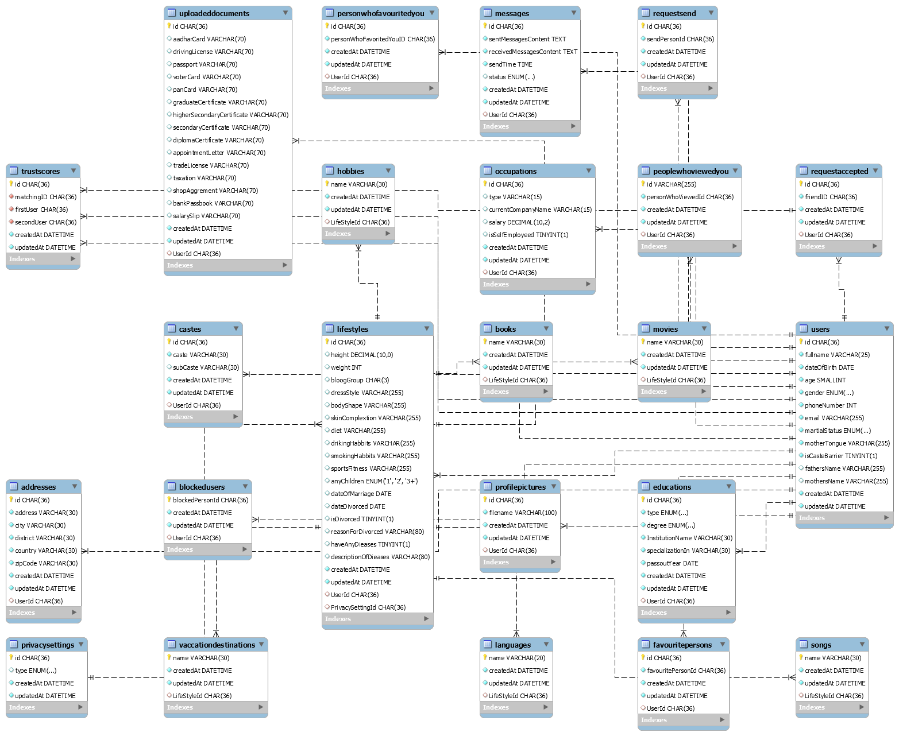

# Matrimonial App Workflow

Last Updated by: Sounish Nath -TCS-1964566_Intern

# UI/UX Utilities

## Bridal Illustations Designs

- [Undraw.co](https://undraw.co/) Spalsh screen setup images and many more.
- [Humaans For Bridal Illustrations](https://blush.design/collections/humaaans) every bridal illustration images.

## Fonts & Iconographics

- Fonts:

  - [Averta Standard Regular](https://fontsfree.net//wp-content/fonts/basic/sans-serif/FontsFree-Net-AvertaStandard-Regular.ttf)

  - [Product Sans Google Font](https://gist.github.com/sounishnath003/e241dac285732cf1eb1633471c20cef7)

- Icons:
  - [Icons8](https://icons8.com/)
  - [Iconsxyz.com](https://iconsvg.xyz/)

## Themes

A **Royal Blued** color with **Lightish Pink** as a accent color.

- Primary Color: ##1114c2
- Accent Color: #ff3d5e
- Or else pls. specify your choice!

<br />

# Coding Standards

## Authentication Modules

- **PHONE_NUMBER_AUTENTICATION:** As we need **authentication via phone number / OTP** in a first priority module to do that we'll be using [Firebase Phone Number Authentication](https://firebase.google.com/docs/auth/web/phone-auth).

- **SOCIAL_LOGIN_OAUTH:** As next signin/signup feature we have Facebook/Google signin for the same we can rely to use firebase basic Auth feature! [Google/Facebook Signin](https://firebase.google.com/docs/auth/web/google-signin).

## External CSS Library

- **[Tailwind CSS](https://tailwindcss.com/)** a utility-first CSS framework packed with classes like flex, pt-4, text-center and rotate-90 that can be composed to build any design, directly in your markup.

## Suggested Technology Stack

- [Typescript](https://www.typescriptlang.org/) is a programming language developed and maintained by Microsoft. It is a strict syntactical superset of JavaScript and adds optional static typing to the language. TypeScript is designed for the development of large applications and transcompiles to JavaScript.

- [Angular](https://angular.io/) to build applications with Angular and reuse your code and abilities to build apps for any deployment target. For web, mobile web, native mobile and native desktop.

- [Ionic Framework - Hybrid app](https://ionicframework.com/) an open source mobile UI toolkit for building high quality, cross-platform native and web app experiences. Move faster with a single code base, running everywhere with JavaScript and the Web.

- [MySQL Database](https://www.mysql.com/) service is a fully managed database service to deploy cloud-native applications. HeatWave, an integrated, high-performance analytics engine

- [Azure Serverless Computations](https://azure.microsoft.com/en-in/services/functions/) helps to develop more efficiently with Functions, an event-driven serverless compute platform that can also solve complex orchestration problems. Build and debug locally without additional setup, deploy and operate at scale in the cloud and integrate services using triggers and bindings.

## Database Design (MYSQL)

_From Eagle's Eye:_ Database Schema Designed.



### Database Schemas

- User

  - Fullname
  - DOB
  - Age (Shadow Entity - Age will automatically calculated) (Indexing)
  - Gender (Male, Female, Prefer Not To Say)
  - PhoneNumbers
  - Email
  - Education (Referential)
  - Matchings (Referential)
  - Verified (Referential)
  - RequestSend (Referential)
  - RequestAccepted (Referential)
  - WhoRejected (Refential)
  - MartialStatus (Indexing)
    - Widowed
    - Marriaged
    - Divorced
    - Separated
  - LifeStyle (Referential)
    - Height (Indexing)
    - Weight
    - BloogGroup
    - LanguageCanSpeak (Bengali, Marathi, Tamil...)
    - DressStyle
    - Favorites
      - Books
      - Songs
      - Movies
    - Vaccition Destination (Indexing)
    - Body Type (Slim, Athletic, Blonde, Chubby)
    - Complextion (VeryFair, Fair, Wheatish, Dark)
    - Any Disability
      - True
      - False
      - Description
    - Diet (Veg, Eggterian, Both, Non-veg, Jain, Vegan)
    - Drinking Habbit (No, Regular, Occasional)
    - Smoking Habbit (No, Regular, Occasional)
    - Hobbies (Movies, Books, Travel, Biking, Hiking, Soccer, Cricket, Foods, Blogging, Dance, Theater, Photography, Musics)
    - Sports & Fitness (Badminton, Swimming, Reading, Yoga, Gym)
    - AnyChildern
      - True
      - False
      - 1 / 2 / 3+
    - Date of Marriage
    - Date of Divorced
    - Reason for Divorced
    - If any diseases
  - Mother tongue (Indexing)
  - Caste (Referential) (Indexing)
  - NoCasteBarrier
    - True
    - False
  - Country
  - Father's Name
  - Mother's Name
  - Address
  - City
  - District
  - Education (Indexing)
    - Graduate (B.Tech, M.Tech, ...)
    - Higher Education School Name
  - Occupation (Referential) (Indexing)
    - Type (Developer, Accountant, Manager...)
    - Current Company Name
    - Salary Offered
    - SelfEmployeed
      - TRUE
      - False
  - Profile Picture (max 10, Bucket)
  - FavoriteLists (Refertials -> User1 --> User2)
  - DocumentsUploaded (Referential)
    - Score (max. x150)
    - PhotoID
      - Aadhar - (10pts)
      - Driving - (10pts)
      - Passport - (10pts)
      - VoterID - (10pts)
      - Pancard - (10pts)
    - EducationProofs
      - Graduate - (10pts)
      - HigherSecondary - (10pts)
      - Secondary - (10pts)
      - Dipmola - (10pts)
    - OccupationalProofs
      - Appointment Letter - (10pts)
      - Trade License - (10pts)
      - TAX - (10pts)
      - Shop Aggrement - (10pts)
      - BankPassbook - (10pts)
      - SalarySlip - (10pts)
  - PrivacySetting (Refer -> LifeStyle, Education, Caste, Occupation)
    - VISIBLE_TO_ALL
    - ONLY_CONNECTIONS_ACCEPTED
    - NONE
  - ViewedYou (Referential -> User1 -> User2)
  - Mutual Matches (...)
  - FavouritedYou (Referential -> User1 -> User2)
  - LocationMatches (Refertials -> User1 --> User2)
    - City
    - Longitude
    - Latitude
    - District
    - User1 (ref)
    - User2 (ref)
  - isOnline
    - TRUE
    - False

- TrustScore

  - MatchingID (Referntial)
  - User1 (Referential <--> DocumentsUploaded->Id)
  - User2 (Referential <--> DocumentsUploaded->Id)
  - Score (1 + 1 = MAX.300)

- ActiveStatus

  - User (Referntials User->Id && User->isOnline)
  - timeStamp

- Messages

  - SentMessages
  - ReceivedMessages
  - SentTime
  - Status

- Chats
  - TrustScore (Referential)
  - User1 (ref.)
  - User2 (ref.)
  - Messages (Referentials)
  - Lastseen
    - User1
    - User2
  - ActiveStatus (Referential)
    - True
    - False

## API Endpoints And Requests

<br />

1. To Get All Users:

   ```bash
   GET /api/users/ HTTP/1.1
   Host: localhost:5000
   ```

2. Sign up using One Time Password (OTP)

   ```bash
   POST /api/auth/signup HTTP/1.1
   Content-Type: application/json
   Host: localhost:5000
   Content-Length: 35

   {
       "phoneNumber": "+918017xxxxxx"
   }
   ```

3. Signup account verification (OTP)

   ```bash
    POST /api/auth/signup/account/verify/otp HTTP/1.1
    Content-Type: application/json
    X-Magic-Token: bc9de28ef6abefcb822ee9e2b042c934b1f513f4b956fb06613143d749461688.1623144512338
    Host: localhost:5000
    Content-Length: 55

    {
      "otpCode": "3072",
      "phoneNumber": "+918017xxxxxx"
    }

   ```

4. Login using One Time Password (OTP)

   ```bash
    POST /api/auth/login/with-otp HTTP/1.1
    Content-Type: application/json
    Host: localhost:5000
    Content-Length: 35

    {
      "phoneNumber": "+918017xxxxxx"
    }
   ```

5. Login OTP verification

   ```bash
    POST /api/auth/login/otp/verify HTTP/1.1
    Content-Type: application/json
    X-Magic-Token: bf20865fbc1e55866e989825c437a8ccf208bfbb1ea90774003e05b0230e4a57.1623756944510
    Host: localhost:5000
    Content-Length: 55

    {
      "otpCode": "3170",
      "phoneNumber": "+918017xxxxxx"
    }
   ```

6. Create Profile Info

   ```bash
      PATCH /api/profile/update-info HTTP/1.1
    Content-Type: application/json
    Host: localhost:5000
    Content-Length: 245

    {
      "fullname": "Sounish Nath",
      "dateOfBirth": "1999-02-17",
      "gender": "Male",
      "email": "a@a.com",
      "martialStatus": "Single",
      "motherTongue": "Bengali",
      "isCasteBarrier": false,
      "fathersName": "Sudip Nath",
      "mothersName": "Manisha Nath"
    }
   ```

7. Add Address Information to User

   ```bash
    POST /api/profile/update-address HTTP/1.1
    Content-Type: application/json
    Host: localhost:5000
    Content-Length: 146

    {
      "address": "H/o - 91, W/o - 11, Nischindipur",
      "city": "Ghatal",
      "district": "Paschim Medinipur",
      "country": "India",
      "zipCode": "721212"
    }
   ```

8. Logout user session

   ```bash
    GET /api/auth/logout HTTP/1.1
    Host: localhost:5000
   ```

9. Add Caste

   ```bash
     POST /api/profile/update-caste HTTP/1.1
     Content-Type: application/json
     Host: localhost:5000
     Content-Length: 44

     {
       "caste": "General",
       "subCaste": "Teli"
     }

   ```

10. Add / Update Lifestyle

    ```bash
      POST /api/profile/update-lifestyle HTTP/1.1
      Content-Type: application/json
      Host: localhost:5000
      Content-Length: 307

      {
        "height": 5.2,
        "weight": 80,
        "bloodGroup": "B+",
        "dressStyle": "Traditional",
        "bodyShape": "Fat",
        "skinComplextion": "Fair",
        "diet": "Vegan",
        "drinkingHabits": "Non drinker",
        "smokingHabits": "Non smoker",
        "sportsFitness": "Ludo",
        "haveAnyDisability": false,
        "descriptionOfDisability": "N/A"
      }
    ```

11. Add Education Details

    ```bash
    POST /api/profile/add-education-details HTTP/1.1
    Content-Type: application/json
    Host: localhost:5000
    Content-Length: 528

    [
      {
        "type": "Undergraduate",
        "degree": "B.Tech",
        "institutionName": "Brainware Group of Institutions",
        "specializationIn": "Computer Science and Engineering",
        "passoutYear": "2021"
      },
      {
        "type": "Higher Secondary",
        "degree": "WBHSE",
        "institutionName": "Ghatal Vidyasagar High School",
        "specializationIn": "Pure Science",
        "passoutYear": "2017"
      },
      {
        "type": "Secondary",
        "degree": "WBBSE",
        "institutionName": "Ghatal Vidyasagar High School",
        "specializationIn": "All",
        "passoutYear": "2015"
      }
    ]

    ```

12. Add Occupation Details

    ```bash
    POST /api/profile/update-occupation-details HTTP/1.1
    Content-Type: application/json
    Host: localhost:5000
    Content-Length: 133

    {
      "type": "Software Engineer",
      "currentCompanyName": "Tata Consultancy Services",
      "salary": "7-8LPA",
      "isSelfEmployeed": false
    }

    ```

13. Add Relative Contact Details (Upto 3)

    ```bash
    POST /api/profile/update-relative-contact-details HTTP/1.1
    Content-Type: application/json
    Host: localhost:5000
    Content-Length: 199

    [
      {
        "relationship": "Brother",
        "fullname": "Sounok Nath",
        "phoneNumber": "+918011xxx855"
      },
      {
        "relationship": "Sister",
        "fullname": "Tiasha Kamilya",
        "phoneNumber": "+91123456789"
      }
    ]
    ```

14. Add / Update Family Details

    ```bash
    POST /api/profile/update-family-details HTTP/1.1
    Content-Type: application/json
    Host: localhost:5000
    Content-Length: 255

    {
      "fatherName": "Sudip Nath",
      "fatherOccupation": "Service",
      "motherName": "Manisha Nath",
      "motherOccupation": "Business",
      "noOfBrothers": 0,
      "noOfSisters": 0,
      "familyValues": "Orthodox",
      "familyStatus": "Middle Class",
      "ancestralOrigin": "N/A"
    }
    ```

15. Upload Profile Pictures (upto 10)

    ```bash
    POST /api/upload-service/profile-pictures/upload HTTP/1.1
    Content-Type: multipart/form-data; boundary=---011000010111000001101001
    Host: localhost:5000
    Content-Length: 313

    -----011000010111000001101001
    Content-Disposition: form-data; name="files"; filename="Hands - Heart.png"
    Content-Type: image/png


    -----011000010111000001101001
    Content-Disposition: form-data; name="files"; filename="Dayflow - Celebrating.png"
    Content-Type: image/png


    -----011000010111000001101001--
    ```

16. Remove Profile Picture

    ```bash
    DELETE /api/upload-service/profile-pictures/delete/7f8ce41f-ba04-4a31-8286-43c9f28ee633 HTTP/1.1
    Host: localhost:5000
    ```

17. Update preffered Partner details

    ```bash
    POST /api/profile/update-preffered-partner HTTP/1.1
    Content-Type: application/json
    Host: localhost:5000
    Content-Length: 272

    {
      "maxHeight": "5.4",
      "minHeight": "4.8",
      "minAge": "24",
      "maxAge": "28",
      "expectedSalary": "9-10LPA",
      "salaryType": "INR",
      "caste": "General",
      "occupation": "Software Engineer",
      "country": "India",
      "martitialStatus": "Never",
      "prefferedMotherTounge": "Hindi"
    }
    ```

18. Add Languages to Lifestyle

    ```bash
    POST /api/profile/update-lifestyle/38a54da6-d4bb-404f-a04b-26c5baa9259d/add-languages HTTP/1.1
    Content-Type: application/json
    Host: localhost:5000
    Content-Length: 70

    [
      {
        "languageName": "Hindi"
      },
      {
        "languageName": "Bengali"
      }
    ]
    ```

19. Profile Recommendations

    ```bash
    GET /api/profiles-recommendations HTTP/1.1
    Host: localhost:5000
    ```

20. Add Hobbies / Interests

    ```bash
    POST /api/profile/update-lifestyle/38a54da6-d4bb-404f-a04b-26c5baa9259d/add-hobbies HTTP/1.1
    Content-Type: application/json
    Host: localhost:5000
    Content-Length: 58

    [
      {
        "hobby": "Campfire"
      },
      {
        "hobby": "Travel"
      }
    ]
    ```

21. Add To Favourites

    ```bash
    POST /api/user/favorites/0/add-to-favourites/ef4f485a-7f7a-498e-a939-108d777e8f86 HTTP/1.1
    Host: localhost:5000
    ```

22. Remove from Favourites

    ```bash
    POST /api/user/favorites/0/remove-from-favourites/858aa799-edd5-4349-9afa-7fe6beb6d10c HTTP/1.1
    Host: localhost:5000
    ```

23. Upload Aadhar Card

    > Check controllers folder for more insights of other documents

    ```bash
    POST /api/upload-service/documents-uploader/upload-aadhar HTTP/1.1
    Content-Type: multipart/form-data; boundary=---011000010111000001101001
    Host: localhost:5000
    Content-Length: 189

    -----011000010111000001101001
    Content-Disposition: form-data; name="file"; filename="Notice CA-3 Exam CSE 8th Sem.pdf"
    Content-Type: application/pdf


    -----011000010111000001101001--
    ```

24. New joiners 3 days ago

    ```bash
      GET /api/just-joiners HTTP/1.1
      Host: localhost:5000
    ```

25. Send Connection Request

    ```bash
      GET /api/request/send/858aa799-edd5-4349-9afa-7fe6beb6d10c HTTP/1.1
      Host: localhost:5000
    ```

26. Remove Request from Person

    ```bash
    POST /api/request/remove/request/435db4f8-16a0-4291-a6a2-ea4f507fef01 HTTP/1.1
    Host: localhost:5000
    ```

27. View all Pending Requests

    ```bash
    GET /api/request/pending/all HTTP/1.1
    Host: localhost:5000
    ```

28. Accept Connect Request

    ```bash
    POST /api/request/accept/ef4f485a-7f7a-498e-a939-108d777e8f86 HTTP/1.1
    Host: localhost:5000
    ```

29. Profiles you Accepted requests

    ```bash
    GET /api/request/accepted/all HTTP/1.1
    Host: localhost:5000
    ```

30. Get All Mutual Matches

    ```bash
      GET /api/mutual-matches HTTP/1.1
      Host: localhost:5000
    ```

## Environment Variables

To run this project, you will need to add the following environment variables to your .env file

- Backend Enviroments Keys:
  - `JWT_ACCESS_TOKEN_SECRET`
  - `JWT_REFRESH_TOKEN_SECRET`
  - `TWILIO_ACCOUNT_SID`
  - `TWILIO_AUTH_TOKEN`
  - `SMS_SECRET_TOKEN`
  - `FCM_SERVER_KEY`

## Authors

- [@sounishnath003](https://www.github.com/sounishnath003)
- [@rachnapatel](https://www.github.com/sounishnath003)
- [@aashrayjain](https://www.github.com/sounishnath003)
- [@ankitkadam](https://www.github.com/sounishnath003)

## Contributing

Contributions are always welcome!

- Always Take a pull of branch / features you want to work upon.
- Always make sure you create a new branch by your `<name>/feature/<title>`
- Contribute very `professionally`.
- Write `production ready` codes.
- `Test your code` before push.

## Systems Design

**NOTE:**

1. All of these are the Opensource Libraries and utilities; nothing to worry about copyright issues.
2. PLEASE SUGGEST RELEVANT CHANGES YOU WANT TO BRING AND ACT ACCORDINGLY!
